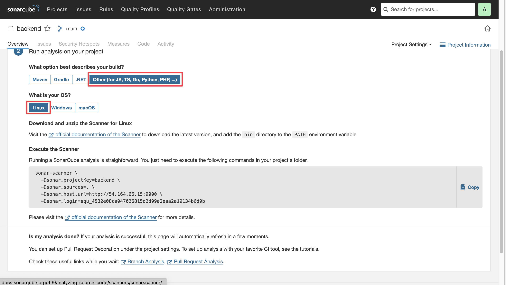
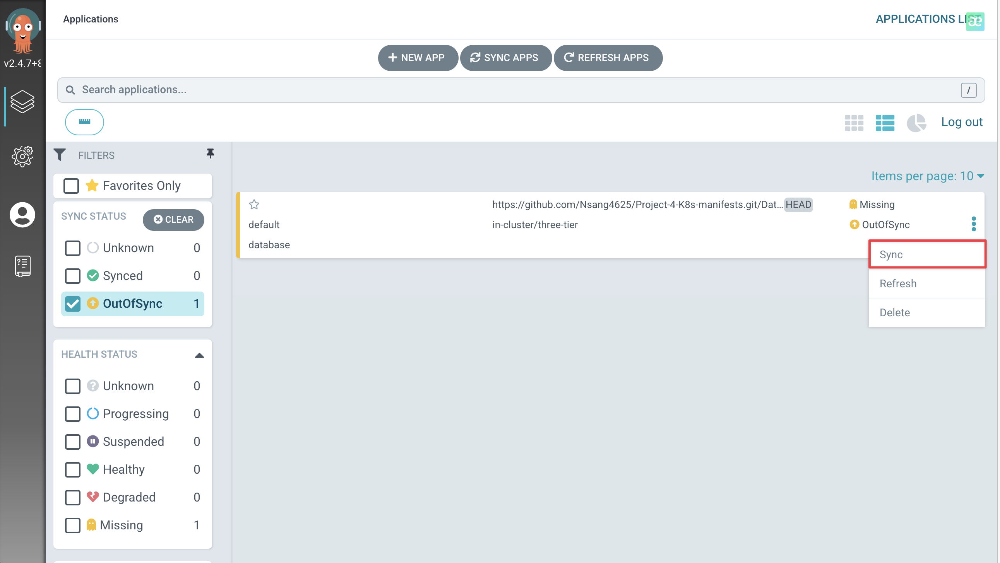
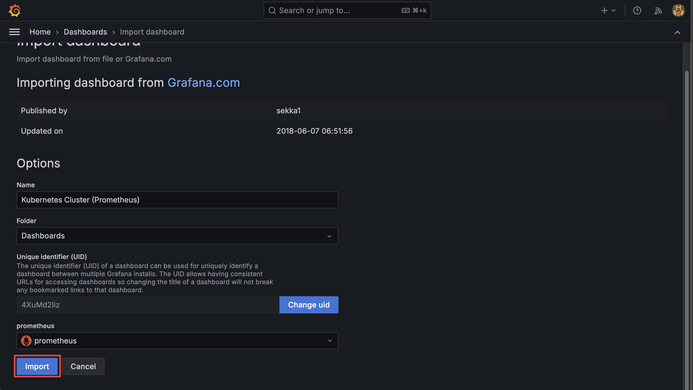

# 🚀 Project introduction

In this project, we will walkthrough the process of configuring a CI/CD pipeline on EKS using Jenkins and ArgoCD. This project aims to show some hands-on experiences in deploying, securing and monitoring an application.

## 🎤 Project overview

In this project, we will cover the following key aspects:

Jenkins Server Configuration: Install and configure essential tools on the Jenkins server, including Jenkins itself, Docker, Sonarqube, Kubectl, AWS CLI, and Trivy.
EKS Cluster Deployment: Utilize eksctl commands to create an Amazon EKS cluster, a managed Kubernetes service on AWS.
Load Balancer Configuration: Configure AWS Application Load Balancer (ALB) for the EKS cluster.
ArgoCD Installation: Install and set up ArgoCD for continuous delivery and GitOps.
Sonarqube Integration: Integrate Sonarqube for code quality analysis in the DevSecOps pipeline.
Jenkins Pipelines: Create Jenkins pipelines for deploying backend and frontend code to the EKS cluster.
Monitoring Setup: Implement monitoring for the EKS cluster using Helm, Prometheus, and Grafana.
ArgoCD Application Deployment: Use ArgoCD to deploy the Three-Tier application, including database, backend, frontend, and ingress components.
Data Persistence: Implement persistent volume and persistent volume claims for database pods to ensure data persistence.
Conclusion and Monitoring: Conclude the project by summarizing key achievements and monitoring the EKS cluster’s performance using Grafana.

Architecture:


## Prerequisites

To follow this project, you must:

- Have an AWS account that has full access for EKS service.
- aws, kubectl and eksctl cli had been configured on your local machine.
- An EC2 instance with type large, opened port 22, 8080 and 9000.
- GitHub account
- DockerHub account, two repository for backend and frontend images.

## 👉 Details

- [🚀 Project introduction](#-project-introduction)
  - [🎤 Project overview](#-project-overview)
  - [Prerequisites](#prerequisites)
  - [👉 Details](#-details)
    - [1. Installing Jenkins and related tools](#1-installing-jenkins-and-related-tools)
    - [2. Configuring tools](#2-configuring-tools)
    - [3. Configuring EKS cluster](#3-configuring-eks-cluster)
      - [3.1 Create EKS cluster](#31-create-eks-cluster)
      - [3.2 Install add-ons for EKS](#32-install-add-ons-for-eks)
      - [3.3 Install ArgoCD](#33-install-argocd)
    - [4. Set up CI/CD pipeline](#4-set-up-cicd-pipeline)
      - [4.1 Configure external credentials in Jenkins](#41-configure-external-credentials-in-jenkins)
      - [4.2 Set up CICD pipelines](#42-set-up-cicd-pipelines)
    - [5. Monitoring set up](#5-monitoring-set-up)
    - [6. Clean resources](#6-clean-resources)

### 1. Installing Jenkins and related tools

In this section, we will walk through the process of installing Jenkins, Docker, Trivy, SonarQube.

All of these tools are configured on the same machine.

- Install Jenkins:
  - SSH to our EC2 instance and run following commands:

```bash
sudo apt update
sudo apt install fontconfig openjdk-17-jre
java -version

#jenkins
sudo wget -O /usr/share/keyrings/jenkins-keyring.asc \
https://pkg.jenkins.io/debian-stable/jenkins.io-2023.key
echo deb [signed-by=/usr/share/keyrings/jenkins-keyring.asc] \
https://pkg.jenkins.io/debian-stable binary/ | sudo tee \
/etc/apt/sources.list.d/jenkins.list > /dev/null
sudo apt-get update
sudo apt-get install jenkins
sudo systemctl start jenkins
sudo systemctl enable jenkins
```

-  
  - Access Jenkins's UI with this url: *\<public ip>:8080*
- Install Docker:
  - To install Docker, run these commands:

```bash
# Add Docker's official GPG key:
sudo apt-get update
sudo apt-get install -y ca-certificates curl
sudo install -m 0755 -d /etc/apt/keyrings
sudo curl -fsSL https://download.docker.com/linux/ubuntu/gpg -o /etc/apt/keyrings/docker.asc
sudo chmod a+r /etc/apt/keyrings/docker.asc

# Add the repository to Apt sources:
echo \
  "deb [arch=$(dpkg --print-architecture) signed-by=/etc/apt/keyrings/docker.asc] https://download.docker.com/linux/ubuntu \
  $(. /etc/os-release && echo "$VERSION_CODENAME") stable" | \
  sudo tee /etc/apt/sources.list.d/docker.list > /dev/null
sudo apt-get update
sudo apt-get install -y docker-ce docker-ce-cli containerd.io docker-buildx-plugin docker-compose-plugin
```
  
- - To run docker command inside Jenkins pipeline without *sudo*, run:

```bash
sudo groupadd docker
sudo usermod -aG docker jenkins
newgrp docker
```

- Install Trivy, run the following commands:

```bash
sudo apt-get install -y wget apt-transport-https gnupg lsb-release
wget -qO - https://aquasecurity.github.io/trivy-repo/deb/public.key | sudo apt-key add -
echo deb https://aquasecurity.github.io/trivy-repo/deb $(lsb_release -sc) main | sudo tee -a /etc/apt/sources.list.d/trivy.list
sudo apt-get update
sudo apt-get install -y trivy
```

- Install SonarQube, we can easily run it as a container:
`docker run -d --name sonar -p 9000:9000 sonarqube:lts-community`

> [!WARNING]
> In production, we have to configure a database for SonarQube to ensure high availability.

### 2. Configuring tools

- Configuring Jenkins:
  - To retrieve admin's password for the first time we log in, visit this file */var/lib/jenkins/secrets/initialAdminPasswor*
  - After login successfully, select __Install suggested plugins__:

  - You should create a new admin account here.

  - Let other configuration as default
  - Navigate to Jenkins's Dashboard, select __Plugins__:

  - Search for these plugins and select them all:*Docker Commons*, *Docker Pipeline*, *OWASP Dependency-check*, *SonarQube Scanner*

    - Docker-commons: API plugin, which provides the common shared functionality for various Docker-related plugins, such as credentials and location of Docker Registry
    - Docker Pipeline: Jenkins plugin which allows building, testing, and using Docker images from Jenkins Pipeline projects. This plugin depend on Docker Common
    - OWASP Dependency-Check: This tool attempts to detect publicly disclosed vulnerabilities contained within a project’s dependencies
    - SonarQube Scanner: This plugin allows easy integration in Jenkins projects of SonarQube

- Configuring SonarQube:
  - In your browser, go to \<public ip>:9000. By default, the username and password are *admin*:

  - Create a new password:

  - Next, we must create a token that later, Jenkins will assume it. On our dashboard, select __Administration__, then __Security__, click __User__:

    - Under __Tokens__ label, select it:

    - Enter token's name and choose __Generate__:

    - Copy the token somewhere for later.
  - Then, we create a webhook that will notify our Jenkins when the scanning is done. Select __Configuration__ and choose __Webhooks__:

    - Select __Create__:

    - Enter following information(replace your instance's public IP), then select __Create__:

    - Result:

  - Finnaly, we have to create two projects for our backend and frontend. Here I show how backend project be created, for the frontend project, do similarly:
    - Select __Projects__, click on __Manually__:

    - Enter required information as below, then select __Set Up__:

    - Select __Locally__:

    - Choose *Use existing token*, then paste SonarQube's token that we have created before:

    - Select as below:

    - Copy the command to somewhere for later using.

- Configure SonarQube tool in Jenkins:
  - First, we must add SonarQube token:
    - Go to __Dashboard__ -> __Manage Jenkins__ -> __Credentials__ -> __Systems__ -> __Global credentials__, select __Add Credentials__:

    - Enter information as below, for the __Secret__ field, paste the token from SonarQube:

    - Select __Create__
  - Now, we configure SonarQube tool. Navigate to __Manage Jenkins__ -> __Tools__, then scroll down to __SonarQube Scanner installations__, select __Add SonarQube Scanner__:

  - Enter information as below, then select __Save__:

  - In previous step, we just configure a SonarQube client tool, we need to configure the server too: Navigate to __Manage Jenkins__ -> __System__, scroll down to SonarQube servers section, enter information like this:

  - Click __Save__

- Configure OWASP tool in Jenkins:
  - Navigate to __Manage Jenkins__ -> __Tools__, scroll down to __Dependency-Check installations__, click __Add Dependency-Check__:

  - Select as below, then click __Save__:


### 3. Configuring EKS cluster

> ![NOTE]
> Under this section, all commands run on your local machine, not where Jenkins runs.

#### 3.1 Create EKS cluster

- To create a EKS cluster, we run this command:

```bash
eksctl create cluster --name Project-4 --instance-types=t2.medium -m 2 -M 2 
```

- Previous command will create a cluster in your default region, default vpc, with two t2.medium nodes. After it runs successfully, it will automatically configure our *kubectl* to use that cluster, we can run this command to check:

```bash
kubectl get nodes
```

- Output:

> NAME$~~~~~~~~~~~~~~~~~~~~~~~~~~~~~$STATUS$~~~~~~~$ ROLES$~~~~$AGE$~~~~~$VERSION
> ip-192-168-3-158.ec2.internal$~~~~$Ready    \<none>$~~~$88s$~~~~~~~$v1.30.2-eks-1552ad0
> ip-192-168-55-138.ec2.internal$~~$Ready    \<none>$~~~$95s$~~~~~~~$v1.30.2-eks-1552ad0

#### 3.2 Install add-ons for EKS

- Next, to create a *Service* with type *LoadBalancer*, we need a controller called *aws-load-balancer-controller*. Before deploy that controller, we must set up IAM policy for it, to download the policy content:

```bash
curl -O https://raw.githubusercontent.com/kubernetes-sigs/aws-load-balancer-controller/v2.5.4/docs/install/iam_policy.json
```

- Create the IAM policy from that file, run:

```bash
aws iam create-policy --policy-name AWSLoadBalancerControllerIAMPolicy --policy-document file://iam_policy.json
```

- Because our controller is deployed as pod, it needs a mechanism to use that IAM policy, here we will use IRSA. To create OIDC Provider:

```bash
eksctl utils associate-iam-oidc-provider --cluster=Project-4 --approve
```

- Create a Service Account that assume the IAM policy, remember to replace your account id:

```bash
eksctl create iamserviceaccount --cluster=Project-4 --namespace=kube-system --name=aws-load-balancer-controller --role-name AmazonEKSLoadBalancerControllerRole --attach-policy-arn=arn:aws:iam::<your_account_id>:policy/AWSLoadBalancerControllerIAMPolicy --approve 
```

- Deploy the controller:

```bash
helm repo add eks https://aws.github.io/eks-charts
helm repo update eks
helm install aws-load-balancer-controller eks/aws-load-balancer-controller -n kube-system --set clusterName=Project-4 --set serviceAccount.create=false --set serviceAccount.name=aws-load-balancer-controller
```

- To check if the controller is deployed:

```bash
kubectl get deployment -n kube-system aws-load-balancer-controller
```

- Configure EBS driver: Because later, our monitor tools require persistent volume, we need to install a CSI driver and here I choose EBS CSI driver. Run the following command to install EBS CSI driver:

```bash
eksctl create iamserviceaccount \
        --name ebs-csi-controller-sa \
        --namespace kube-system \
        --cluster Project-4 \
        --role-name AmazonEKS_EBS_CSI_DriverRole \
        --role-only \
        --attach-policy-arn arn:aws:iam::aws:policy/service-role/AmazonEBSCSIDriverPolicy \
        --approve
aws eks create-addon --cluster-name Project-4 --addon-name aws-ebs-csi-driver \
  --service-account-role-arn AmazonEKS_EBS_CSI_DriverRole \
  --configuration-values '{"defaultStorageClass":{"enabled":true}}'
```

#### 3.3 Install ArgoCD

- We will use kubectl to install it:

```bash
kubectl create namespace argocd
kubectl apply -n argocd -f https://raw.githubusercontent.com/argoproj/argo-cd/v2.4.7/manifests/install.yaml
```

- Finnaly, to access ArgoCD from internet, we will expose ArgoCD as a service with type *LoadBalancer*:

```bash
kubectl patch svc argocd-server -n argocd -p '{"spec": {"type": "LoadBalancer"}}'
```

- You can verify that ArgoCD is deployed as LoadBalancer by going to LoadBalancer section on AWS:


### 4. Set up CI/CD pipeline

#### 4.1 Configure external credentials in Jenkins

- Add DockerHub's credential to Jenkins:
  - To retrieve DockerHub's access token, open your browser, login to your DockerHub account, select __Account Settings__:

  - Under __Security__ section, select __Personal access tokens__:

  - Select __Generate new token__:

  - Enter information as below, then click on __Generate__:

  - Copy the token.
  - Navigate to our Jenkins's dashboard, go to __Manage Jenkins__ -> __Credentials__ -> __System__ -> __Global credentials__, select __Add Credentials__ then enter your username and password(pasted the copied token):


- Add GitHub's credential to Jenkins:
  - Open your browser, navigate to your github account, select __Settings__ -> __Developer settings__ -> __Personal access tokens__ -> __Tokens__:

  - Select __Generate new token__, then __Generate new token(classic)__:

  - Under __Select scopes__ section, enable __repo__:

  - Select __Generate token__:

  - Copy the token.
  - Return to our Jenkins's dashboard, go to __Manage Jenkins__ -> __Credentials__ -> __System__ -> __Global credentials__, select __Add Credentials__, enter information as below:

  - Select __Create__

#### 4.2 Set up CICD pipelines

- Create webhooks: Our pipelines will be triggered from Github with webhook. Because we have two repository, two pipeline, we have to configure two webhook, but for demo purpose, I will only show you how to configure webhook for *backend* repository, the other is very similar:
  - Go to your backend repository, select __Settings__:

  - On the sidebar, select __Webhooks__:

  - Select __Add webhook__:

  - Enter information below, remember to replace your Jenkins's public IP to the Payload URL:


> ![NOTE]
> By default, Jenkins will listen for webhook on path /github-webhook/, but we can customize it by changing on __Manage Jenkins__ -> __System__ -> __GitHub__

- Create pipelines: We have to create two pipelines, one for backend repository and the other for frontend repository. Here I will show how to create the pipeline for backend:
  - Navigate to Jenkins's dashboard, select __New Item__:

  - Enter pipeline's name and select type as __Pipeline__:

  - Select as below:


  - Pipeline's output:


- Configure ArgoCD: Use ArgoCD service's DNS name, open it in browser:


> ![NOTE]
> By default, a default username is created, named admin. You can view its password with this command:

```bash
kubectl -n argocd get secret argocd-initial-admin-secret -o jsonpath="{.data.password}" | base64 -d ; echo
```

- With deployment stage, we will run it manually, not automation.
- Click __Settings__:

- Select __Repositories__:

- Select __Connect repo using HTTPS__:

- Provide the username and GitHub Personal Access token and click on __CONNECT__:

- If __CONNECTION STATUS__ is *Successful*, means that you have configured connection successfully:

- Now we will create 4 application, including database, backend, ingress, frontend.
- Select __New App__:

- We will create database application, fill in information as below, remember to replace your own repository:


  - The path is relative path from your repository.
- To deploy this application, select on __Sync__:

- Replace those steps for create backend, ingress, frontend application, remember to replace their own name, path and follow exactly the order.

> ![NOTE]
> When deploy ingress, EKS will create an application load balancer, you can retrieve it by command `kubectl get ingress -n three-tier`. Then before deploy frontend, replace it under *env[0].name*.

- Results:

- Open Ingress's DNS name, we can see our website that has been deployed successfully:


### 5. Monitoring set up

To achieve monitoring, we will install two tools which are Prometheus and Grafana, using Helm:

- Install Prometheus and Grafana:

```bash
helm repo add stable https://charts.helm.sh/stable
# Install Prometheus
helm repo add prometheus-community https://prometheus-community.github.io/helm-charts
helm install prometheus prometheus-community/prometheus
# Install Grafana
helm repo add grafana https://grafana.github.io/helm-charts
helm repo update
helm install grafana grafana/grafana
```

- Check if all required service had been deployed, run:

```bash
kubectl get svc
```

- Output:


- Expose monitor services to Internet:

```bash
# Expose Prometheus server
kubectl patch svc prometheus-server -p '{"spec": {"type": "LoadBalancer"}}'
# Expose Grafana server
kubectl patch svc grafana -p '{"spec": {"type": "LoadBalancer"}}'
```

- Run `kubectl get svc`, copy service prometheus-server's external IP, paste to your browser. You can view target list by click __Status__ -> __Targets__:


- Copy grafana service's external IP, paste to your browser:


> ![NOTE]
> By default, a default username is created, named admin. You can view its password with this command:

```bash
kubectl get secret --namespace default grafana -o jsonpath="{.data.admin-password}" | base64 --decode ; echo
```

- Now, we will configure Grafana to use Prometheus as data source. Select __Data Sources__:

- Click on __Prometheus__:

- Enter Prometheus's URL and select __Skip TLS certificate validation__:

- Click __Save & Test__:

- Connection test result:

- Navigate to __Dashboard__, select __New__ -> __Import__:

- Enter field as below and click __Load__:

- Select __Import__:

- Our dashboard:


### 6. Clean resources

- Delete all Kubernetes service and ingress, for ensuring there will no ALB left orphaned:

```bash
kubectl delete --all -A svc
kubectl delete --all -A ingress
```

- Delete EKS cluster: run this command:

```bash
eksctl delete cluster -n Project-4
```

- Delete EBS volumes.

- Delete EC2 instance where Jenkins is hosted: Go to your AWS console, stop and terminate it.
